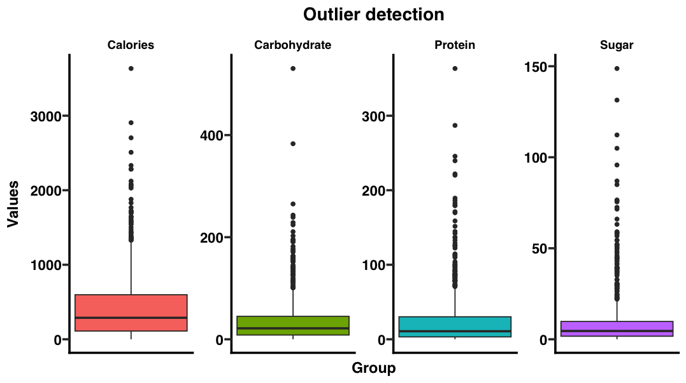

# 04. Outliers

# Español

## Indicaciones

### Dificultad: Medio

Repasemos ahora los `outliers` un concepto muy interesante pero que muchas veces no sabemos interpretar del todo bien.

Un outlier es un valor que se encuentra muy alejado del resto de los datos en un conjunto. Estos valores pueden ser el resultado de errores de medición, errores de entrada de datos o pueden representar fenómenos raros pero legítimos. Identificar y manejar los outliers es crucial en el análisis de datos, ya que pueden influir significativamente en los resultados estadísticos y en la interpretación de los datos.

Para ello en este ejercicio aprenderemos como identificar outliers de manera gráfica utilizando nuestros queridos boxplots (cajas y bigotes), pero además deberás crear una tabla en la que resumas los outliers positivos y negativos.

Fórmulas: $$ IQR = Q3 - Q1$$ $$ lower = Q1 - (1.5 * IQR) $$ $$ higher = Q3 + (1.5 * IQR)$$

¡Vamos!

# 04. Outliers

# English

## Instructions

### Difficulty: Medium

Let's now review `outliers`, a very interesting concept that we often do not fully understand.

An outlier is a value that is significantly different from the rest of the data in a dataset. These values can be the result of measurement errors, data entry errors, or they can represent rare but legitimate phenomena. Identifying and handling outliers is crucial in data analysis, as they can significantly influence statistical results and data interpretation.

To do this, in this exercise we will learn how to identify outliers graphically using our beloved boxplots, but you will also need to create a table summarizing the positive and negative outliers.

Let's practice!
